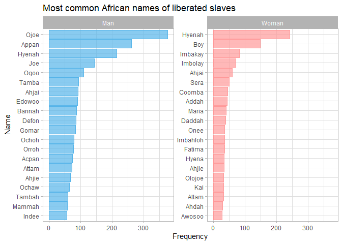

African-American History
================
Machiel Visser
16/06/2020

### Load packages and set theme

``` r
library(tidytuesdayR)
library(tidyverse)
library(scales)
library(ggwordcloud)
library(tidytext)
library(grid)
library(ggraph)
library(ggrepel)

theme_set(theme_light())
```

### Download data

``` r
tuesdata <- tidytuesdayR::tt_load('2020-06-16')
```

    ## 
    ##  Downloading file 1 of 4: `census.csv`
    ##  Downloading file 2 of 4: `slave_routes.csv`
    ##  Downloading file 3 of 4: `african_names.csv`
    ##  Downloading file 4 of 4: `blackpast.csv`

### Slave routes

``` r
(slave_routes <- tuesdata$slave_routes)
```

    ## # A tibble: 36,110 x 8
    ##    voyage_id ship_name port_origin place_of_purcha~ port_arrival year_arrival
    ##        <dbl> <chr>     <chr>       <chr>            <chr>               <dbl>
    ##  1     81711 Hannah    Liverpool   Calabar          St. Vincent~         1787
    ##  2     81712 Hannah    Liverpool   New Calabar      Grenada, po~         1789
    ##  3     81713 Hannah    Liverpool   Bight of Biafra~ Kingston             1789
    ##  4     81714 Hannah    Liverpool   Bonny            St. Vincent~         1791
    ##  5     81715 Hannah    Liverpool   Congo River      Grenada, po~         1792
    ##  6     81716 Hannah    Liverpool   Ambriz           Kingston             1793
    ##  7     81717 Hannah    Liverpool   <NA>             <NA>                 1794
    ##  8     81718 Hannibal  London      Bonny            Dominica, p~         1785
    ##  9     81723 Harlequin Liverpool   Cape Mount (Cap~ Barbados, p~         1797
    ## 10     81724 Harlequin Liverpool   West Central Af~ St. Kitts, ~         1798
    ## # ... with 36,100 more rows, and 2 more variables: n_slaves_arrived <dbl>,
    ## #   captains_name <chr>

``` r
slave_routes %>% 
  filter(!is.na(n_slaves_arrived)) %>% 
  ggplot(aes(x = n_slaves_arrived)) +
  geom_histogram(binwidth = 50, colour = "black", alpha = 0.6) +
  labs(x = "Number of slaves",
       y = "Frequency",
       title = "Number of slaves that arrived in each ship")
```

<!-- -->

``` r
slave_routes %>% 
  filter(!is.na(ship_name),
         !is.na(n_slaves_arrived),
         fct_lump(ship_name, 15) != "Other") %>% 
  mutate(ship_name = fct_reorder(ship_name, n_slaves_arrived, median)) %>% 
  ggplot(aes(x = n_slaves_arrived, y = ship_name, fill = ship_name)) +
  geom_boxplot(alpha = 0.5, show.legend = FALSE) +
  labs(x = "Number of slaves arrived",
       y = "Ship name",
       title = "Number of slaves that arrived by the 15 largest ships")
```

<!-- -->

``` r
slave_routes %>% 
  ggplot(aes(x = year_arrival)) +
  geom_histogram(binwidth = 5, alpha = 0.8) +
  geom_vline(xintercept = c(1776, 1807, 1865), linetype = 2) +
  labs(x = "Year of arrival",
       y = "Number of voyages",
       title = "Number of slave ships over time",
       subtitle = "1776: Declaration of Independence
1807: Slave trade illegal in USA and UK
1865: End of Civil War")
```

<!-- -->

``` r
slave_routes %>% 
  filter(!is.na(port_origin),
         fct_lump(port_origin, 20) != "Other") %>% 
  mutate(port_origin = str_replace(port_origin, ", port unspecified", ""),
         port_origin = fct_reorder(port_origin, year_arrival)) %>% 
  count(port_origin, 
        decade = 10 * (year_arrival %/% 10), 
        sort = TRUE) %>% 
  ggplot(aes(x = decade, y = n, colour = port_origin)) +
  geom_line(size = 1, show.legend = FALSE) +
  geom_vline(xintercept = 1807, lty = 2) +
  scale_y_continuous(minor_breaks = NULL) +
  facet_wrap(~ port_origin, ncol = 4) +
  labs(x = "Decade",
       y = "Number of ships",
       title = "Number of slave ships departing from 20 important ports",
       subtitle = "UK and USA made slave trade illegal in 1807")
```

<!-- -->

``` r
set.seed(123)

slave_routes %>% 
  mutate(port_origin = str_replace(port_origin, ", port unspecified", ""),
         port_arrival = str_replace(port_arrival, ", port unspecified", "")) %>% 
  count(port_origin, port_arrival, sort = TRUE) %>% 
  filter(port_origin != port_arrival) %>% 
  head(50) %>% 
  ggraph(layout = "fr") +
  geom_edge_link(aes(edge_colour = n), edge_width = 1,
                 arrow = arrow(type = "closed", length = unit(3, "mm"))) +
  geom_node_point() +
  geom_node_text(aes(label = name), repel = TRUE) +
  scale_edge_color_gradient(low = "yellow", high = "red") +
  scale_edge_width_continuous(range = c(0.5, 4)) +
  labs(title = "50 most common slave routes",
       edge_colour = "Number of ships")
```

<!-- -->

### Census data

``` r
(census <- tuesdata$census)
```

    ## # A tibble: 102 x 8
    ##    region    division  year    total    white   black black_free black_slaves
    ##    <chr>     <chr>    <dbl>    <dbl>    <dbl>   <dbl>      <dbl>        <dbl>
    ##  1 USA Total <NA>      1870 38558371 33589377 4880009    4880009            0
    ##  2 USA Total <NA>      1860 31443321 26922537 4441830     488070      3953760
    ##  3 USA Total <NA>      1850 23191876 19553068 3638808     434495      3204313
    ##  4 USA Total <NA>      1840 17063353 14189705 2873648     386293      2487355
    ##  5 USA Total <NA>      1830 12860702 10532060 2328642     619599      1709043
    ##  6 USA Total <NA>      1820  9638453  7866797 1771656     233634      1538022
    ##  7 USA Total <NA>      1810  7239881  5862073 1377808     186446      1191362
    ##  8 USA Total <NA>      1800  5308483  4306446 1002037     108435       893602
    ##  9 USA Total <NA>      1790  3929214  3172006  757208      59527       697681
    ## 10 Northeast <NA>      1870 12298730 12117269  179738     179738            0
    ## # ... with 92 more rows

``` r
census_long <- census %>% 
  mutate(other = total - white - black) %>% 
  arrange(year) %>% 
  pivot_longer(cols = c(white, black_free, black_slaves, other), 
               names_to = "racial_category", 
               values_to = "population") %>% 
  mutate(racial_category = str_replace(racial_category, "black_free", "black (free)"),
         racial_category = str_replace(racial_category, "black_slaves", "black (slaves)"))

census_long %>% 
  filter(region == "USA Total",
         racial_category %in% c("black (free)", "black (slaves)")) %>% 
  mutate(racial_category = fct_recode(racial_category, free = "black (free)",
                                      slaves = "black (slaves)")) %>% 
  ggplot(aes(x = year, y = population, fill = racial_category)) +
  geom_col() +
  scale_x_continuous(breaks = seq(1790, 1870, 10), minor_breaks = NULL) +
  scale_y_continuous(labels = scales::comma) +
  labs(title = "Black population in the USA",
       x = "Year",
       y = "Population size", 
       fill = "Black population")
```

<!-- -->

``` r
census_long %>% 
  filter(region == "USA Total",
         racial_category != "other") %>% 
  ggplot(aes(x = year, y = population, fill = racial_category)) +
  geom_col() +
  scale_x_continuous(breaks = seq(1790, 1870, 10), minor_breaks = NULL) +
  scale_y_continuous(labels = scales::comma) +
  labs(x = "Year",
       y = "Census population",
       fill = "Racial category",
       title = "Total population size in the USA by ethnic group, 1790-1870")
```

<!-- -->

``` r
census_long %>% 
  filter(region != "USA Total",
         is.na(division),
         racial_category != "other") %>% 
  ggplot(aes(x = year, y = population, fill = racial_category)) +
  geom_col() +
  scale_x_continuous(breaks = seq(1790, 1870, 20)) +
  scale_y_continuous(labels = scales::comma) +
  facet_wrap(~ region) +
  labs(x = "Year",
       y = "Census population",
       fill = "Racial category",
       title = "Ethnic population size of US regions, 1790-1870")
```

<!-- -->

``` r
census_long %>% 
  filter(region != "USA Total",
         !is.na(division),
         racial_category != "other") %>% 
  mutate(division = fct_reorder(division, -population, sum)) %>% 
  ggplot(aes(x = year, y = population, fill = racial_category)) +
  geom_col() +
  scale_x_continuous(breaks = seq(1790, 1870, 20)) +
  scale_y_continuous(labels = scales::comma, minor_breaks = NULL) +
  facet_wrap(~ division) +
  labs(x = "Year",
       y = "Census population",
       fill = "Racial category",
       title = "Ethnic population size of US divisions, 1790-1870")
```

<!-- -->

``` r
census_long %>% 
  filter(region != "USA Total",
         !is.na(division),
         racial_category != "other") %>% 
  mutate(division = fct_reorder(division, -population, sum)) %>% 
  group_by(division, year) %>% 
  mutate(percent = population / sum(population)) %>% 
  ggplot(aes(x = year, y = percent, fill = racial_category)) +
  geom_col() +
  scale_x_continuous(breaks = seq(1790, 1870, 20)) +
  scale_y_continuous(labels = scales::percent, minor_breaks = NULL) +
  facet_wrap(~ division) +
  labs(x = "Year",
       y = "Percentage of census population",
       fill = "Racial category",
       title = "Census racial makeup of USA by division, 1790-1870")
```

<!-- -->

### African names of liberated slaves

``` r
(african_names <- tuesdata$african_names)
```

    ## # A tibble: 91,490 x 11
    ##       id voyage_id name  gender   age height ship_name year_arrival
    ##    <dbl>     <dbl> <chr> <chr>  <dbl>  <dbl> <chr>            <dbl>
    ##  1     1      2314 Bora  Man       30   62.5 NS de Re~         1819
    ##  2     2      2315 Flam  Man       30   64   Fabiana           1819
    ##  3     3      2315 Dee   Man       28   65   Fabiana           1819
    ##  4     4      2315 Pao   Man       22   62.5 Fabiana           1819
    ##  5     5      2315 Mufa  Man       16   59   Fabiana           1819
    ##  6     6      2315 Latty Man       22   67.5 Fabiana           1819
    ##  7     7      2315 So    Man       20   62   Fabiana           1819
    ##  8     8      2315 Trua  Man       30   65.5 Fabiana           1819
    ##  9     9      2315 Tou   Man       18   61.5 Fabiana           1819
    ## 10    10      2315 Quaco Man       23   62   Fabiana           1819
    ## # ... with 91,480 more rows, and 3 more variables: port_disembark <chr>,
    ## #   port_embark <chr>, country_origin <chr>

``` r
set.seed(123)

african_names %>% 
  filter(!is.na(gender)) %>% 
  mutate(gender = fct_recode(gender, Man = "Boy", Woman = "Girl")) %>% 
  count(name, gender, sort = TRUE) %>% 
  group_by(gender) %>%
  slice(1:50) %>% 
  ungroup() %>%
  ggplot(aes(label = name, size = n, colour = gender)) +
  geom_text_wordcloud() +
  scale_colour_manual(values = c("#56B4E9", "#FF9999")) +
  labs(title = "Word cloud of African names of liberated slaves",
       colour = "Gender")
```

<!-- -->

``` r
african_names %>% 
  filter(!is.na(gender)) %>% 
  mutate(gender = fct_recode(gender, Man = "Boy", Woman = "Girl")) %>% 
  count(name, gender, sort = TRUE) %>% 
  group_by(gender) %>%
  slice(1:20) %>% 
  ungroup() %>% 
  mutate(name = reorder_within(name, n, gender)) %>% 
  ggplot(aes(x = n, y = name, colour = gender, fill = gender)) +
  geom_col(alpha = 0.7, show.legend = FALSE) +
  scale_y_reordered() +
  scale_colour_manual(values = c("#56B4E9", "#FF9999")) +
  scale_fill_manual(values = c("#56B4E9", "#FF9999")) +
  facet_wrap(~ gender, scales = "free_y") +
  labs(x = "Frequency",
       y = "Name",
       title = "Most common African names of liberated slaves")
```

<!-- -->

``` r
african_names %>% 
  mutate(gender = fct_recode(gender, Man = "Boy", Woman = "Girl")) %>% 
  filter(!is.na(gender),
         !is.na(age)) %>% 
  ggplot(aes(x = age, colour = gender)) +
  stat_density(geom = "line", position = "identity", size = 2, alpha = 0.7) +
  scale_colour_manual(values = c("#56B4E9", "#FF9999")) +
  labs(x = "Age",
       y = "Density",
       colour = "Gender",
       title = "Age distribution of African slaves")
```

<!-- -->

``` r
african_names %>% 
  filter(!is.na(gender),
         !is.na(age)) %>%
  group_by(gender) %>% 
  mutate(mu = mean(age)) %>% 
  ungroup() %>% 
  ggplot(aes(x = age, colour = gender, fill = gender)) +
  geom_histogram(binwidth = 2, alpha = 0.5, show.legend = FALSE) +
  geom_vline(aes(xintercept = mu), linetype = "dashed")+
  facet_wrap(~ gender) +
  labs(x = "Age",
       y = "Frequency",
       title = "Age of African slaves")
```

<!-- -->

``` r
african_names %>% 
  filter(year_arrival < 1850,
         !is.na(gender)) %>% 
  group_by(year_arrival, gender) %>% 
  summarise(age = mean(age, na.rm = TRUE)) %>% 
  ggplot(aes(x = year_arrival, y = age, colour = gender)) +
  geom_line(size = 2, alpha = 0.6) +
  # geom_smooth(method = "lm") +
  scale_y_continuous(limits = c(0, NA)) +
  labs(x = "Year of arrival",
       y = "Age",
       colour = "Gender",
       title = "Mean age of African slaves over time")
```

<!-- -->

``` r
african_names %>% 
  mutate(gender = fct_recode(gender, Man = "Boy", Woman = "Girl")) %>% 
  filter(!is.na(gender),
         !is.na(height)) %>% 
  ggplot(aes(x = height, colour = gender)) +
  stat_density(geom = "line", position = "identity", size = 2, alpha = 0.7) +
  scale_colour_manual(values = c("#56B4E9", "#FF9999")) +
  labs(x = "Height (inches)",
       y = "Density",
       colour = "Gender",
       title = "Height distribution of African slaves")
```

<!-- -->

``` r
african_names %>% 
  filter(!is.na(gender),
         !is.na(height)) %>% 
  group_by(gender) %>% 
  mutate(mu = mean(height)) %>% 
  ungroup() %>% 
  ggplot(aes(x = height, colour = gender, fill = gender)) +
  geom_histogram(binwidth = 2, alpha = 0.5, show.legend = FALSE) +
  geom_vline(aes(xintercept = mu), linetype = "dashed")+
  facet_wrap(~ gender) +
  labs(x = "Height (inches)",
       y = "Frequency",
       title = "Height of African slaves")
```

<!-- -->

``` r
african_names %>% 
  filter(year_arrival < 1850,
         !is.na(gender)) %>% 
  group_by(year_arrival, gender) %>% 
  summarise(height = mean(height, na.rm = TRUE)) %>% 
  ggplot(aes(x = year_arrival, y = height, colour = gender)) +
  geom_line(size = 2, alpha = 0.6) +
  scale_y_continuous(limits = c(0, NA)) +
  labs(x = "Year of arrival",
       y = "Height (inches)",
       colour = "Gender",
       title = "Mean height of African slaves over time")
```

<!-- -->

``` r
african_names %>% 
  filter(!is.na(gender)) %>% 
  ggplot(aes(x = gender, y = year_arrival, fill = gender)) +
  geom_boxplot(alpha = 0.5, show.legend = FALSE) +
  labs(x = "Gender",
       y = "Year of arrival",
       title = "Year of arrival of African slaves")
```

<!-- -->

``` r
african_names %>% 
  group_by(name) %>% 
  summarise(n = n(),
            age = mean(age, na.rm = TRUE),
            year_arrival = mean(year_arrival, na.rm = TRUE)) %>% 
  ungroup() %>% 
  arrange(-n) %>% 
  slice(1:50) %>% 
  ggplot(aes(x = year_arrival, y = age))  +
  geom_point(aes(fill = n, size = n), shape = 21, alpha = 0.7) +
  scale_fill_continuous(low = "yellow", high = "red", guide = "legend") +
  scale_size_continuous(range = c(1, 10)) +
  geom_text_repel(aes(label = name), size = 3) +
  labs(x = "Year of arrival",
       y = "Age",
       fill = "Number of people",
       size = "Number of people",
       title = "Mean age and year of arrival of African slaves with the same name")
```

<!-- -->
