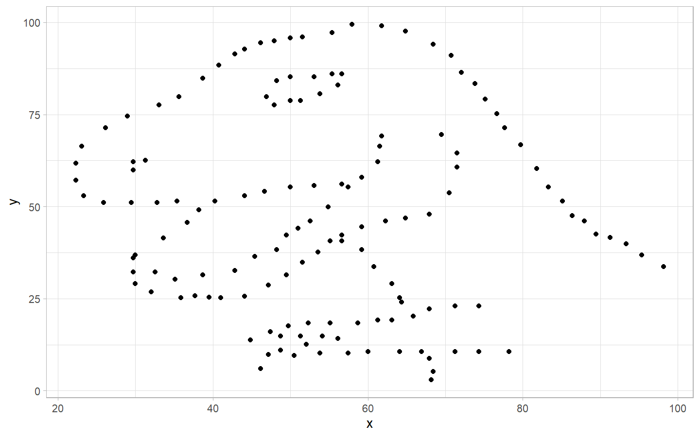
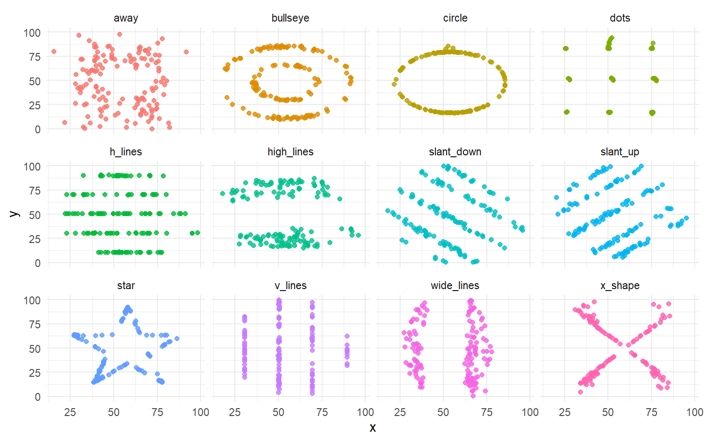
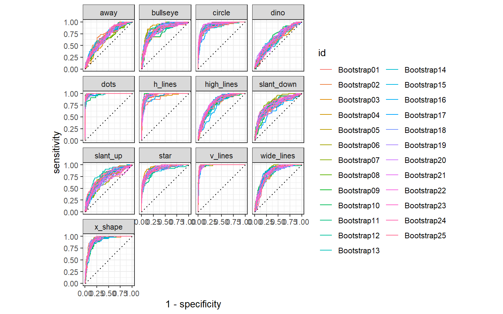
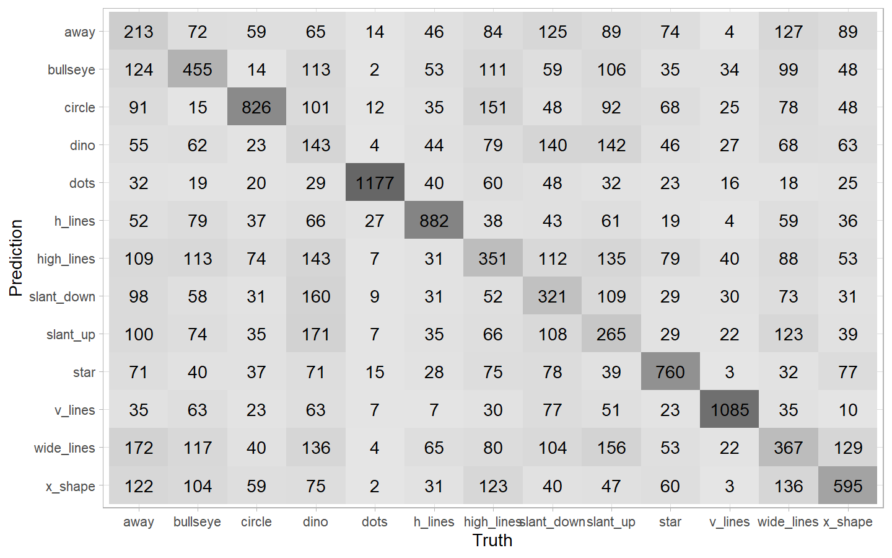
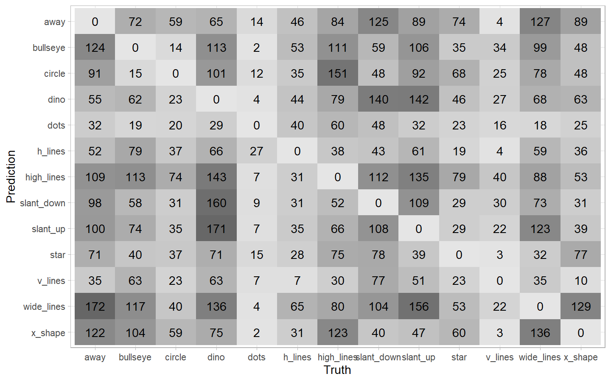

Datasaurus Dozen
================
Machiel Visser
20/10/2020

## Load packages and set theme

``` r
library(knitr)
library(tidyverse)
library(tidytuesdayR)
library(tidymodels)
library(foreach)
library(doParallel)

theme_set(theme_light())
```

## Download data

``` r
tuesdata <- tidytuesdayR::tt_load('2020-10-13')
```

    ## 
    ##  Downloading file 1 of 1: `datasaurus.csv`

``` r
(datasaurus <- tuesdata$datasaurus)
```

    ## # A tibble: 1,846 x 3
    ##    dataset     x     y
    ##    <chr>   <dbl> <dbl>
    ##  1 dino     55.4  97.2
    ##  2 dino     51.5  96.0
    ##  3 dino     46.2  94.5
    ##  4 dino     42.8  91.4
    ##  5 dino     40.8  88.3
    ##  6 dino     38.7  84.9
    ##  7 dino     35.6  79.9
    ##  8 dino     33.1  77.6
    ##  9 dino     29.0  74.5
    ## 10 dino     26.2  71.4
    ## # ... with 1,836 more rows

## Plot datasets

``` r
datasaurus %>% 
  filter(dataset == "dino") %>% 
  ggplot(aes(x, y)) +
  geom_point(show.legend = FALSE)
```

<!-- -->

``` r
datasaurus %>% 
  filter(dataset != "dino") %>% 
  ggplot(aes(x, y, colour = dataset)) +
  geom_point(alpha = 0.8, show.legend = FALSE) +
  facet_wrap(~ dataset, ncol = 4) +
  theme_minimal()
```

<!-- -->

## Summary statistics

``` r
datasaurus %>% 
    group_by(dataset) %>% 
    summarize(x_mean  = mean(x),
              y_mean  = mean(y),
              x_sd    = sd(x),
              y_sd    = sd(y),
              cor_x_y = cor(x, y))
```

    ## # A tibble: 13 x 6
    ##    dataset    x_mean y_mean  x_sd  y_sd cor_x_y
    ##    <chr>       <dbl>  <dbl> <dbl> <dbl>   <dbl>
    ##  1 away         54.3   47.8  16.8  26.9 -0.0641
    ##  2 bullseye     54.3   47.8  16.8  26.9 -0.0686
    ##  3 circle       54.3   47.8  16.8  26.9 -0.0683
    ##  4 dino         54.3   47.8  16.8  26.9 -0.0645
    ##  5 dots         54.3   47.8  16.8  26.9 -0.0603
    ##  6 h_lines      54.3   47.8  16.8  26.9 -0.0617
    ##  7 high_lines   54.3   47.8  16.8  26.9 -0.0685
    ##  8 slant_down   54.3   47.8  16.8  26.9 -0.0690
    ##  9 slant_up     54.3   47.8  16.8  26.9 -0.0686
    ## 10 star         54.3   47.8  16.8  26.9 -0.0630
    ## 11 v_lines      54.3   47.8  16.8  26.9 -0.0694
    ## 12 wide_lines   54.3   47.8  16.8  26.9 -0.0666
    ## 13 x_shape      54.3   47.8  16.8  26.9 -0.0656

## YouTube Screencast by Julia Silge

<https://www.youtube.com/watch?v=QhAPA_X-ilA>

### Build a classification model

``` r
set.seed(1234)
dino_folds <- datasaurus %>% 
  mutate(dataset = factor(dataset)) %>% 
  bootstraps()

dino_folds
```

    ## # Bootstrap sampling 
    ## # A tibble: 25 x 2
    ##    splits             id         
    ##    <list>             <chr>      
    ##  1 <split [1.8K/674]> Bootstrap01
    ##  2 <split [1.8K/677]> Bootstrap02
    ##  3 <split [1.8K/674]> Bootstrap03
    ##  4 <split [1.8K/663]> Bootstrap04
    ##  5 <split [1.8K/671]> Bootstrap05
    ##  6 <split [1.8K/649]> Bootstrap06
    ##  7 <split [1.8K/682]> Bootstrap07
    ##  8 <split [1.8K/673]> Bootstrap08
    ##  9 <split [1.8K/662]> Bootstrap09
    ## 10 <split [1.8K/685]> Bootstrap10
    ## # ... with 15 more rows

``` r
rf_spec <- rand_forest(trees = 1000) %>% 
  set_mode("classification") %>% 
  set_engine("ranger")

rf_spec
```

    ## Random Forest Model Specification (classification)
    ## 
    ## Main Arguments:
    ##   trees = 1000
    ## 
    ## Computational engine: ranger

``` r
dino_wf <- workflow() %>% 
  add_model(rf_spec) %>% 
  add_formula(dataset ~ x + y)

dino_wf
```

    ## == Workflow ==========================================================================================
    ## Preprocessor: Formula
    ## Model: rand_forest()
    ## 
    ## -- Preprocessor --------------------------------------------------------------------------------------
    ## dataset ~ x + y
    ## 
    ## -- Model ---------------------------------------------------------------------------------------------
    ## Random Forest Model Specification (classification)
    ## 
    ## Main Arguments:
    ##   trees = 1000
    ## 
    ## Computational engine: ranger

``` r
doParallel::registerDoParallel()
dino_rs <- fit_resamples(dino_wf,
                         resamples = dino_folds,
                         control = control_resamples(save_pred = TRUE))

dino_rs
```

    ## # Bootstrap sampling 
    ## # A tibble: 25 x 5
    ##    splits            id          .metrics       .notes         .predictions     
    ##    <list>            <chr>       <list>         <list>         <list>           
    ##  1 <split [1.8K/674~ Bootstrap01 <tibble [2 x ~ <tibble [0 x ~ <tibble [674 x 1~
    ##  2 <split [1.8K/677~ Bootstrap02 <tibble [2 x ~ <tibble [0 x ~ <tibble [677 x 1~
    ##  3 <split [1.8K/674~ Bootstrap03 <tibble [2 x ~ <tibble [0 x ~ <tibble [674 x 1~
    ##  4 <split [1.8K/663~ Bootstrap04 <tibble [2 x ~ <tibble [0 x ~ <tibble [663 x 1~
    ##  5 <split [1.8K/671~ Bootstrap05 <tibble [2 x ~ <tibble [0 x ~ <tibble [671 x 1~
    ##  6 <split [1.8K/649~ Bootstrap06 <tibble [2 x ~ <tibble [0 x ~ <tibble [649 x 1~
    ##  7 <split [1.8K/682~ Bootstrap07 <tibble [2 x ~ <tibble [0 x ~ <tibble [682 x 1~
    ##  8 <split [1.8K/673~ Bootstrap08 <tibble [2 x ~ <tibble [0 x ~ <tibble [673 x 1~
    ##  9 <split [1.8K/662~ Bootstrap09 <tibble [2 x ~ <tibble [0 x ~ <tibble [662 x 1~
    ## 10 <split [1.8K/685~ Bootstrap10 <tibble [2 x ~ <tibble [0 x ~ <tibble [685 x 1~
    ## # ... with 15 more rows

### Evaluate classification model

``` r
collect_metrics(dino_rs)
```

    ## # A tibble: 2 x 5
    ##   .metric  .estimator  mean     n std_err
    ##   <chr>    <chr>      <dbl> <int>   <dbl>
    ## 1 accuracy multiclass 0.441    25 0.00315
    ## 2 roc_auc  hand_till  0.842    25 0.00149

``` r
dino_rs %>% 
  collect_predictions() %>% 
  group_by(id) %>% 
  ppv(dataset, .pred_class)
```

    ## # A tibble: 25 x 4
    ##    id          .metric .estimator .estimate
    ##    <chr>       <chr>   <chr>          <dbl>
    ##  1 Bootstrap01 ppv     macro          0.414
    ##  2 Bootstrap02 ppv     macro          0.438
    ##  3 Bootstrap03 ppv     macro          0.438
    ##  4 Bootstrap04 ppv     macro          0.447
    ##  5 Bootstrap05 ppv     macro          0.420
    ##  6 Bootstrap06 ppv     macro          0.420
    ##  7 Bootstrap07 ppv     macro          0.411
    ##  8 Bootstrap08 ppv     macro          0.409
    ##  9 Bootstrap09 ppv     macro          0.420
    ## 10 Bootstrap10 ppv     macro          0.418
    ## # ... with 15 more rows

``` r
dino_rs %>% 
  collect_predictions() %>% 
  group_by(id) %>% 
  roc_curve(dataset, .pred_away:.pred_x_shape) %>% 
  autoplot()
```

<!-- -->

``` r
dino_rs %>% 
  collect_predictions() %>% 
  conf_mat(dataset, .pred_class) %>% 
  autoplot(type = "heatmap")
```

<!-- -->

``` r
dino_rs %>% 
  collect_predictions() %>% 
  filter(.pred_class != dataset) %>% 
  conf_mat(dataset, .pred_class) %>% 
  autoplot(type = "heatmap")
```

<!-- -->

## Resources

<https://www.autodesk.com/research/publications/same-stats-different-graphs>

<https://cran.r-project.org/web/packages/datasauRus/vignettes/Datasaurus.html>
