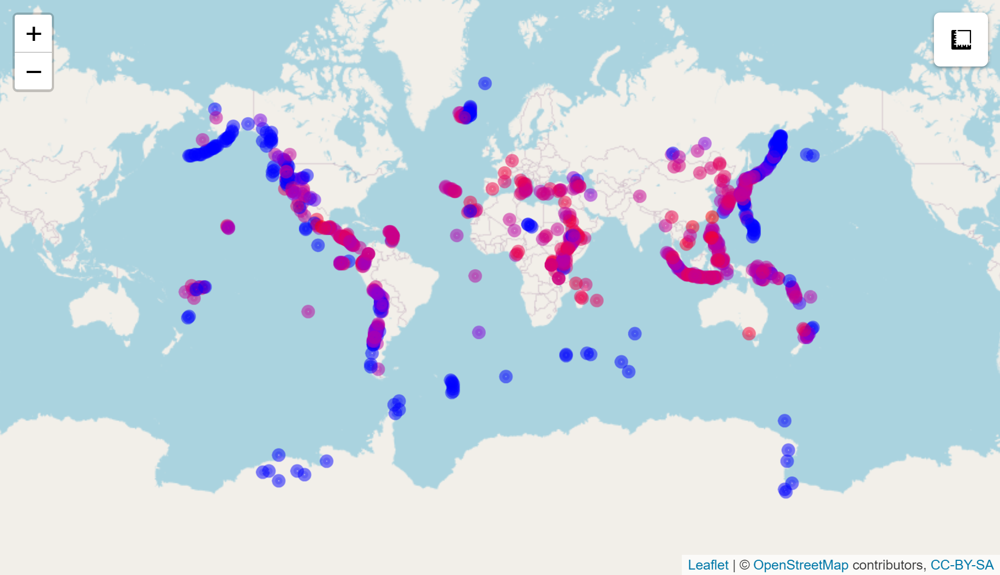
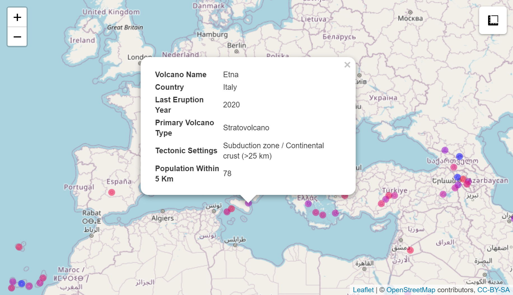

```{r, echo = FALSE}
knitr::opts_chunk$set(echo = TRUE, warning = FALSE, message = FALSE,
                      dpi = 180, fig.width = 8, fig.height = 5,
                      fig.path = "Volcano-Eruptions-figs/VE-")
```


### Load packages and set theme

```{r}
library(knitr)
library(tidyverse)
library(tidytuesdayR)
library(leaflet)
library(gganimate)
library(tidymodels)
library(themis)
library(ranger)
library(vip)
library(janitor)
library(scales)

theme_set(theme_light())
```


### Download data

```{r}
tuesdata <- tidytuesdayR::tt_load("2020-05-12")
```


### Volcanoes

```{r}
(volcano <- tuesdata$volcano %>% 
   mutate(primary_volcano_type = str_remove(primary_volcano_type, "\\(.*\\)"),
         primary_volcano_type = str_remove(primary_volcano_type, "\\?"),
         last_eruption_year = as.numeric(na_if(last_eruption_year, "Unknown"))))
```

```{r}
volcano %>% 
  count(primary_volcano_type, sort = TRUE) %>% 
  mutate(primary_volcano_type = reorder(primary_volcano_type, n)) %>% 
  ggplot(aes(x = n, y = primary_volcano_type, 
             color = primary_volcano_type, fill = primary_volcano_type)) +
  geom_bar(stat = "identity", alpha = 0.7, show.legend = FALSE) +
  geom_text(aes(label = n), colour = "black", nudge_x = 15) +
  geom_hline(yintercept = 10.5, linetype = 2) +
  labs(x = "Frequency",
       y = "Primary volcano type",
       title = "Number of volcanoes by type")
```

```{r}
volcano %>% 
  mutate(primary_volcano_type = fct_lump(primary_volcano_type, n = 6)) %>% 
  ggplot(aes(x = longitude, y = latitude, colour = primary_volcano_type)) +
  borders() +
  geom_point() +
  coord_quickmap() +
  labs(x = "",
       y  = "",
       colour = "Type",
       title = "Volcanoes around the world") +
  theme(panel.grid = element_blank(),
        axis.text = element_blank(),
        axis.ticks = element_blank())
```


```{r}
world <- map_data("world")

volcano %>% 
  mutate(primary_volcano_type = fct_lump(primary_volcano_type, n = 2)) %>% 
  ggplot() +
  geom_map(data = world, map = world, 
           aes(long, lat, map_id = region),
           colour = "white", fill = "gray50", alpha = 0.3) +
  geom_point(aes(x = longitude, y = latitude, colour = primary_volcano_type)) +
  coord_quickmap() +
  labs(x = "",
       y  = "",
       colour = "Type",
       title = "Volcanoes around the world")
```


```{r}
volcano %>% 
  mutate(years_ago = 2020 - last_eruption_year) %>% 
  filter(!is.na(years_ago)) %>%
  ggplot(aes(x = years_ago + 1, colour = evidence_category, fill = evidence_category)) +
  geom_histogram(alpha = 0.7) +
  scale_x_log10()+
  labs(x = "Years ago (log10 scale)",
       y = "Frequency",
       colour = "Evidence",
       fill = "Evidence",
       title = "Time since last eruption of each volcano")
```


### Eruptions

```{r}
(eruptions <- tuesdata$eruptions)

eruptions %>% 
  mutate(years_ago = 2020 - start_year,
         eruption_category = str_replace(eruption_category, " Eruption", "")) %>% 
    filter(!is.na(years_ago)) %>%
  ggplot(aes(x = years_ago + 1, colour = eruption_category, fill = eruption_category)) +
  geom_histogram(alpha = 0.7) +
  scale_x_log10()+
  labs(x = "Years ago (log10 scale)",
       y = "Frequency",
       colour = "Eruption",
       fill = "Eruption",
       title = "Time since each volcanic eruption")
```


```{r}
library(lubridate)

eruptions %>%
  filter(!is.na(start_year),
         !is.na(end_year)) %>% 
  mutate(start_month = replace_na(start_month, 1),
         start_month = replace(start_month, start_month == 0, 1),
         start_day = replace_na(start_day, 1),
         start_day = replace(start_day, start_day == 0, 1),
         start_ymd = as.Date(lubridate::make_date(start_year, start_month, start_day)),
         end_month = replace_na(end_month, 1),
         end_month = replace(end_month, end_month == 0, 1),
         end_day = replace_na(end_day, 1),
         end_day = replace(end_day, end_day == 0, 1),
         end_ymd = as.Date(lubridate::make_date(end_year, end_month, end_day)),
         diff_ymd = end_ymd - start_ymd) %>% 
  filter(diff_ymd < 800) %>% 
  ggplot(aes(x = diff_ymd)) +
  geom_histogram(binwidth = 10, colour = "black", alpha = 0.6) +
  labs(x = "Days",
       y = "Frequency",
       title = "Number of days that a volcanic eruption last")
```


### Interactive map

```{r eval=FALSE}
volcano %>% 
  mutate(transformed_pop = log2(population_within_5_km + 1),
         pop_col = colorNumeric(c("blue", "red"), transformed_pop)(transformed_pop)) %>% 
  gather(key, value, 
         volcano_name, country, last_eruption_year, primary_volcano_type, 
         tectonic_settings, population_within_5_km) %>% 
  mutate(key = str_to_title(str_replace_all(key, "_", " ")),
         key = paste0("<b>", key, "</b>")) %>% 
  replace_na(list(value = "Unknown")) %>% 
  nest(data = c(key, value)) %>% 
  mutate(html = map(data, knitr::kable,
                    format = "html",
                    escape = FALSE,
                    col.names = c("", ""))) %>% 
  leaflet() %>% 
  addTiles() %>% 
  addMeasure() %>% 
  addCircleMarkers(lat = ~ latitude,
                   lng = ~ longitude,
                   color = ~ pop_col,
                   radius = 3,
                   popup = ~ html)
  
```

The interactive map of the world does not work in the R Markdown output, but can be used in R. Instead, the result is shown in the two figures below. You can select each volcano and read about its properties.




### Volcano Explosivity Index

```{r}
eruptions %>% 
  filter(start_year >= 1900,
         !is.na(vei)) %>% 
  mutate(vei = as.integer(vei),
         volume = 0.00001 * 10 ^ vei) %>% 
  ggplot(aes(x = longitude, y = latitude)) +
  borders() +
  geom_point(aes(colour = vei, size = volume)) +
  coord_quickmap() +
  scale_colour_gradient(low = "yellow", high = "red") +
  scale_size_continuous(range = c(.1, 6)) +
  labs(x = "",
       y = "",
       colour = "VEI",
       size = bquote(km^3),
       title = "Volcanic eruptions since 1990") +
  theme(panel.grid = element_blank(),
        axis.text = element_blank(),
        axis.ticks = element_blank())
```


### GIF animation of volcano eruptions over time

The animation does not work in the R Markdown output, but the code can be used in R to make an animated GIF of the volcano eruptions over time.

```{r eval=FALSE}
eruptions_anim <- eruptions %>% 
  filter(start_year >= 1900,
         !is.na(vei)) %>% 
  mutate(vei = as.integer(vei),
         volume = 0.00001 * 10 ^ vei) %>% 
  ggplot(aes(x = longitude, y = latitude)) +
  borders() +
  geom_point(aes(colour = vei, size = volume)) +
  coord_quickmap() +
  scale_colour_gradient(low = "yellow", high = "red") +
  scale_size_continuous(range = c(.1, 6), guide = FALSE) +
  transition_time(start_year) +
  labs(x = "",
       y = "",
       colour = "VEI",
       title = "Volcanic eruptions in year { round(frame_time) }") +
  theme(panel.grid = element_blank(),
        axis.text = element_blank(),
        axis.ticks = element_blank())

animate(eruptions_anim, nframes = 150, fps = 4)

anim_save("Eruptions.gif")
```


### Multiclass random forest classifier to predict volcano type

Select variables of interest.

```{r}
volcano_df <- volcano %>% 
  transmute(volcano_number, longitude, latitude, elevation,
            volcano_type = case_when(str_detect(primary_volcano_type, 
                                                "Stratovolcano") ~ "Stratovolcano",
                                     str_detect(primary_volcano_type, 
                                                "Shield") ~ "Shield", 
                                     TRUE ~ "Other"),
            tectonic_settings, major_rock_1) %>% 
  mutate_if(is.character, factor)
```

Create bootstrap resamples to train and test the model.

```{r}
set.seed(2020)
(volcano_boot <- bootstraps(volcano_df))
```

Make recipe for the classification model.

```{r}
volcano_rec <- recipe(volcano_type ~ ., data = volcano_df) %>% 
  update_role(volcano_number, new_role = "id") %>% # select ID variable
  step_other(tectonic_settings) %>%                # pool into "other" category
  step_other(major_rock_1) %>%                     # pool into "other" category
  step_dummy(tectonic_settings, major_rock_1) %>%  # make dummy variables
  step_zv(all_predictors()) %>%                    # remove variables with zero variance
  step_normalize(all_predictors()) %>%             # normalise predictors
  step_smote(volcano_type)                         # oversample minority classes
```

Train the data according to the recipe.

```{r}
(volcano_prep <- prep(volcano_rec))
```

Equal classes, because of oversampling with the SMOTE algorithm.

```{r}
juice(volcano_prep) %>% count(volcano_type)
```

Use random forest for classification.

```{r}
(rf_spec <- rand_forest(trees = 1000) %>% 
   set_mode("classification") %>% 
   set_engine("ranger"))
```

Modelling workflow.

```{r}
(volcano_wf <- workflow() %>% 
   add_recipe(volcano_rec) %>% 
   add_model(rf_spec))
```

Fit model on bootstrapped resamples

```{r}
(volcano_res <- fit_resamples(volcano_wf,
                              resamples = volcano_boot,
                              control = control_resamples(save_pred = TRUE,
                                                          verbose = TRUE)))
```

Accuracy and AUC.

```{r}
volcano_res %>% 
  collect_metrics()
```

Confusion matrix of the predictions.

```{r}
volcano_res %>% 
  collect_predictions() %>% 
  conf_mat(volcano_type, .pred_class)
```


```{r}
volcano_res %>% 
  collect_predictions() %>% 
  group_by(id) %>% 
  ppv(volcano_type, .pred_class) %>% 
  ggplot(aes(.estimate)) +
  geom_histogram(bins = 10, colour = "black", alpha = 0.6) +
  labs(x = "Positive predictive value",
       y = "Frequency",
       title = "Distribution of classification performance on bootstraps")
```

Variable importance plot.

```{r}
rf_spec %>% 
  set_engine("ranger", importance = "permutation") %>% 
  fit(volcano_type ~ ., 
      data = juice(volcano_prep) %>% 
        select(-volcano_number) %>% 
        janitor::clean_names()) %>% 
  vip(geom = "point")
```

Map prediction accuracy for each volcano on the world map.

```{r}
volcano_pred <- volcano_res %>% 
  collect_predictions() %>% 
  mutate(correct = volcano_type == .pred_class) %>% 
  left_join(volcano_df %>% 
              mutate(.row = row_number()))

ggplot() +
  geom_map(data = world, map = world, 
           aes(long, lat, map_id = region),
           colour = "white", fill = "gray50", alpha = 0.3) +
  stat_summary_hex(data = volcano_pred, 
                   aes(x = longitude, y = latitude, z = as.integer(correct)),
                   fun = "mean", alpha = 0.7, bins = 60) +
  scale_fill_gradient(high = "cyan2", labels = scales::percent) +
  coord_quickmap() +
  labs(x = "",
       y = "",
       fill = "",
       title = "Prediction accuracy of volcano type") +
  theme(panel.grid = element_blank(),
        axis.text = element_blank(),
        axis.ticks = element_blank())
```
