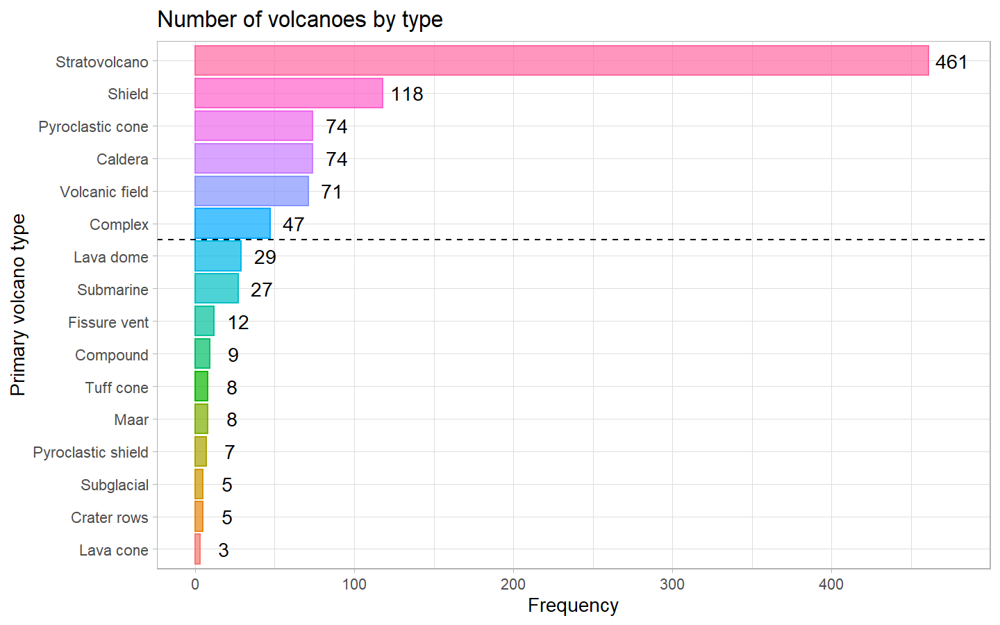
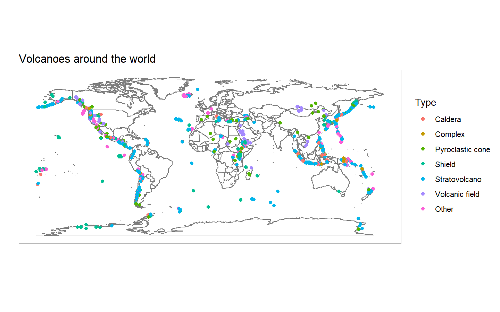
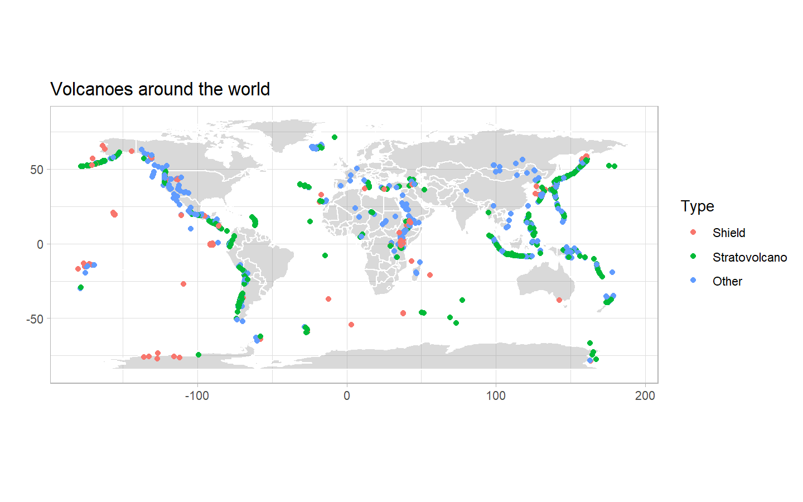
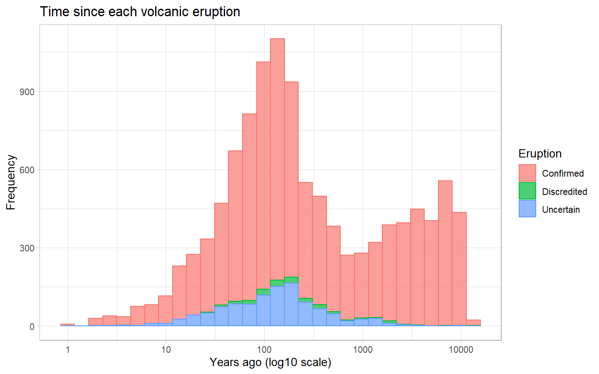
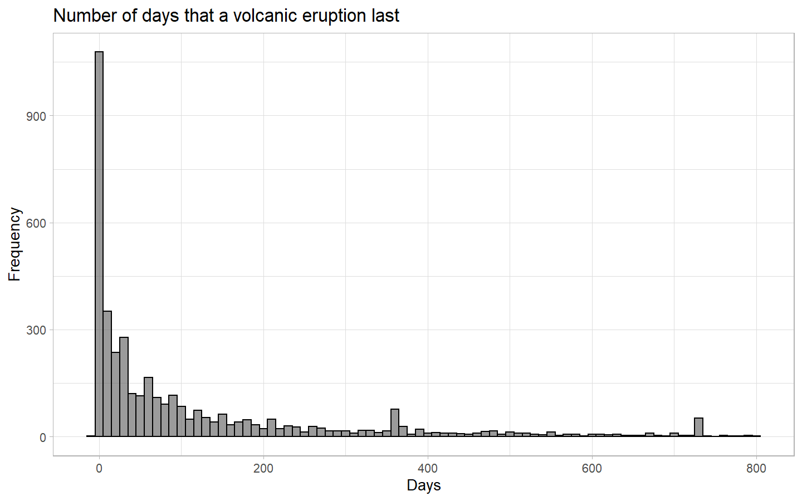
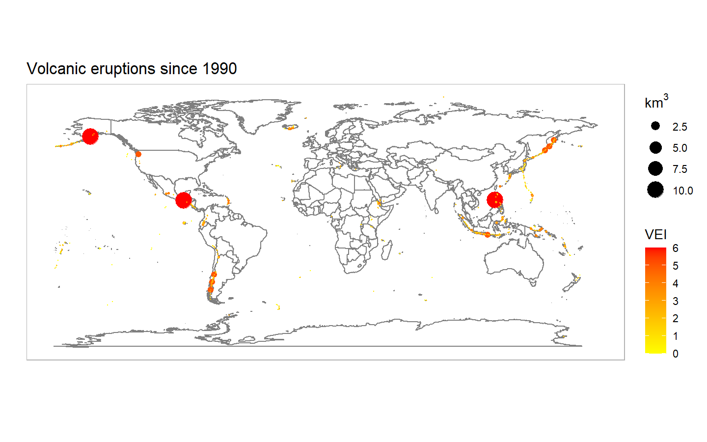
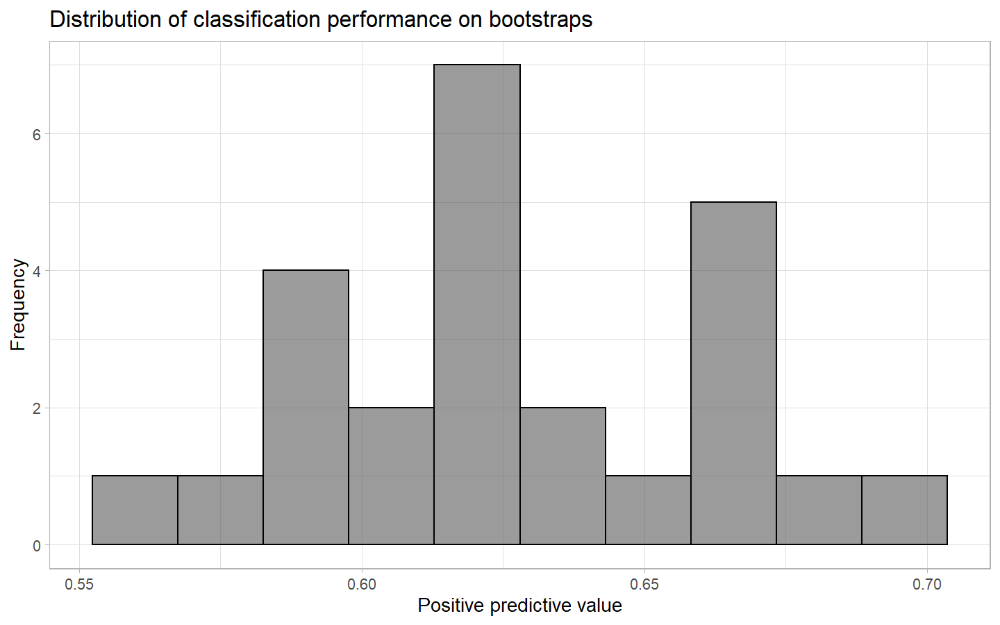
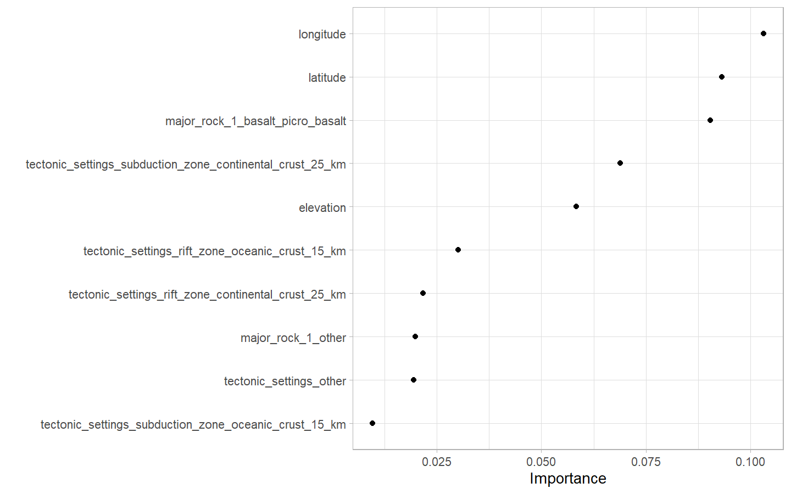

Volcanic Eruptions
================
Machiel Visser
12/05/2020

### Load packages and set theme

``` r
library(knitr)
library(tidyverse)
library(tidytuesdayR)
library(leaflet)
library(gganimate)
library(tidymodels)
library(themis)
library(ranger)
library(vip)
library(janitor)
library(scales)

theme_set(theme_light())
```

### Download data

``` r
tuesdata <- tidytuesdayR::tt_load("2020-05-12")
```

    ## 
    ##  Downloading file 1 of 5: `eruptions.csv`
    ##  Downloading file 2 of 5: `events.csv`
    ##  Downloading file 3 of 5: `sulfur.csv`
    ##  Downloading file 4 of 5: `tree_rings.csv`
    ##  Downloading file 5 of 5: `volcano.csv`

### Volcanoes

``` r
(volcano <- tuesdata$volcano %>% 
   mutate(primary_volcano_type = str_remove(primary_volcano_type, "\\(.*\\)"),
         primary_volcano_type = str_remove(primary_volcano_type, "\\?"),
         last_eruption_year = as.numeric(na_if(last_eruption_year, "Unknown"))))
```

    ## # A tibble: 958 x 26
    ##    volcano_number volcano_name primary_volcano~ last_eruption_y~ country region
    ##             <dbl> <chr>        <chr>                       <dbl> <chr>   <chr> 
    ##  1         283001 Abu          Shield                      -6850 Japan   Japan~
    ##  2         355096 Acamarachi   Stratovolcano                  NA Chile   South~
    ##  3         342080 Acatenango   Stratovolcano                1972 Guatem~ Méxic~
    ##  4         213004 Acigol-Nevs~ Caldera                     -2080 Turkey  Medit~
    ##  5         321040 Adams        Stratovolcano                 950 United~ Canad~
    ##  6         283170 Adatarayama  Stratovolcano                1996 Japan   Japan~
    ##  7         221170 Adwa         Stratovolcano                  NA Ethiop~ Afric~
    ##  8         221110 Afdera       Stratovolcano                  NA Ethiop~ Afric~
    ##  9         284160 Agrigan      Stratovolcano                1917 United~ Japan~
    ## 10         342100 Agua         Stratovolcano                  NA Guatem~ Méxic~
    ## # ... with 948 more rows, and 20 more variables: subregion <chr>,
    ## #   latitude <dbl>, longitude <dbl>, elevation <dbl>, tectonic_settings <chr>,
    ## #   evidence_category <chr>, major_rock_1 <chr>, major_rock_2 <chr>,
    ## #   major_rock_3 <chr>, major_rock_4 <chr>, major_rock_5 <chr>,
    ## #   minor_rock_1 <chr>, minor_rock_2 <chr>, minor_rock_3 <chr>,
    ## #   minor_rock_4 <chr>, minor_rock_5 <chr>, population_within_5_km <dbl>,
    ## #   population_within_10_km <dbl>, population_within_30_km <dbl>,
    ## #   population_within_100_km <dbl>

``` r
volcano %>% 
  count(primary_volcano_type, sort = TRUE) %>% 
  mutate(primary_volcano_type = reorder(primary_volcano_type, n)) %>% 
  ggplot(aes(x = n, y = primary_volcano_type, 
             color = primary_volcano_type, fill = primary_volcano_type)) +
  geom_bar(stat = "identity", alpha = 0.7, show.legend = FALSE) +
  geom_text(aes(label = n), colour = "black", nudge_x = 15) +
  geom_hline(yintercept = 10.5, linetype = 2) +
  labs(x = "Frequency",
       y = "Primary volcano type",
       title = "Number of volcanoes by type")
```

<!-- -->

``` r
volcano %>% 
  mutate(primary_volcano_type = fct_lump(primary_volcano_type, n = 6)) %>% 
  ggplot(aes(x = longitude, y = latitude, colour = primary_volcano_type)) +
  borders() +
  geom_point() +
  coord_quickmap() +
  labs(x = "",
       y  = "",
       colour = "Type",
       title = "Volcanoes around the world") +
  theme(panel.grid = element_blank(),
        axis.text = element_blank(),
        axis.ticks = element_blank())
```

<!-- -->

``` r
world <- map_data("world")

volcano %>% 
  mutate(primary_volcano_type = fct_lump(primary_volcano_type, n = 2)) %>% 
  ggplot() +
  geom_map(data = world, map = world, 
           aes(long, lat, map_id = region),
           colour = "white", fill = "gray50", alpha = 0.3) +
  geom_point(aes(x = longitude, y = latitude, colour = primary_volcano_type)) +
  coord_quickmap() +
  labs(x = "",
       y  = "",
       colour = "Type",
       title = "Volcanoes around the world")
```

<!-- -->

``` r
volcano %>% 
  mutate(years_ago = 2020 - last_eruption_year) %>% 
  filter(!is.na(years_ago)) %>%
  ggplot(aes(x = years_ago + 1, colour = evidence_category, fill = evidence_category)) +
  geom_histogram(alpha = 0.7) +
  scale_x_log10()+
  labs(x = "Years ago (log10 scale)",
       y = "Frequency",
       colour = "Evidence",
       fill = "Evidence",
       title = "Time since last eruption of each volcano")
```

<!-- -->

### Eruptions

``` r
(eruptions <- tuesdata$eruptions)
```

    ## # A tibble: 11,178 x 15
    ##    volcano_number volcano_name eruption_number eruption_catego~ area_of_activity
    ##             <dbl> <chr>                  <dbl> <chr>            <chr>           
    ##  1         266030 Soputan                22354 Confirmed Erupt~ <NA>            
    ##  2         343100 San Miguel             22355 Confirmed Erupt~ <NA>            
    ##  3         233020 Fournaise, ~           22343 Confirmed Erupt~ <NA>            
    ##  4         345020 Rincon de l~           22346 Confirmed Erupt~ <NA>            
    ##  5         353010 Fernandina             22347 Confirmed Erupt~ <NA>            
    ##  6         273070 Taal                   22344 Confirmed Erupt~ <NA>            
    ##  7         282050 Kuchinoerab~           22345 Confirmed Erupt~ <NA>            
    ##  8         241040 Whakaari/Wh~           22338 Confirmed Erupt~ 1978/90 Crater ~
    ##  9         311060 Semisopochn~           22341 Confirmed Erupt~ <NA>            
    ## 10         284096 Nishinoshima           22340 Confirmed Erupt~ <NA>            
    ## # ... with 11,168 more rows, and 10 more variables: vei <dbl>,
    ## #   start_year <dbl>, start_month <dbl>, start_day <dbl>,
    ## #   evidence_method_dating <chr>, end_year <dbl>, end_month <dbl>,
    ## #   end_day <dbl>, latitude <dbl>, longitude <dbl>

``` r
eruptions %>% 
  mutate(years_ago = 2020 - start_year,
         eruption_category = str_replace(eruption_category, " Eruption", "")) %>% 
    filter(!is.na(years_ago)) %>%
  ggplot(aes(x = years_ago + 1, colour = eruption_category, fill = eruption_category)) +
  geom_histogram(alpha = 0.7) +
  scale_x_log10()+
  labs(x = "Years ago (log10 scale)",
       y = "Frequency",
       colour = "Eruption",
       fill = "Eruption",
       title = "Time since each volcanic eruption")
```

<!-- -->

``` r
library(lubridate)

eruptions %>%
  filter(!is.na(start_year),
         !is.na(end_year)) %>% 
  mutate(start_month = replace_na(start_month, 1),
         start_month = replace(start_month, start_month == 0, 1),
         start_day = replace_na(start_day, 1),
         start_day = replace(start_day, start_day == 0, 1),
         start_ymd = as.Date(lubridate::make_date(start_year, start_month, start_day)),
         end_month = replace_na(end_month, 1),
         end_month = replace(end_month, end_month == 0, 1),
         end_day = replace_na(end_day, 1),
         end_day = replace(end_day, end_day == 0, 1),
         end_ymd = as.Date(lubridate::make_date(end_year, end_month, end_day)),
         diff_ymd = end_ymd - start_ymd) %>% 
  filter(diff_ymd < 800) %>% 
  ggplot(aes(x = diff_ymd)) +
  geom_histogram(binwidth = 10, colour = "black", alpha = 0.6) +
  labs(x = "Days",
       y = "Frequency",
       title = "Number of days that a volcanic eruption last")
```

<!-- -->

### Interactive map

``` r
volcano %>% 
  mutate(transformed_pop = log2(population_within_5_km + 1),
         pop_col = colorNumeric(c("blue", "red"), transformed_pop)(transformed_pop)) %>% 
  gather(key, value, 
         volcano_name, country, last_eruption_year, primary_volcano_type, 
         tectonic_settings, population_within_5_km) %>% 
  mutate(key = str_to_title(str_replace_all(key, "_", " ")),
         key = paste0("<b>", key, "</b>")) %>% 
  replace_na(list(value = "Unknown")) %>% 
  nest(data = c(key, value)) %>% 
  mutate(html = map(data, knitr::kable,
                    format = "html",
                    escape = FALSE,
                    col.names = c("", ""))) %>% 
  leaflet() %>% 
  addTiles() %>% 
  addMeasure() %>% 
  addCircleMarkers(lat = ~ latitude,
                   lng = ~ longitude,
                   color = ~ pop_col,
                   radius = 3,
                   popup = ~ html)
```

The interactive map of the world does not work in the R Markdown output,
but can be used in R. Instead, the result is shown in the two figures
below. You can select each volcano and read about its properties.

 

### Volcano Explosivity Index

``` r
eruptions %>% 
  filter(start_year >= 1900,
         !is.na(vei)) %>% 
  mutate(vei = as.integer(vei),
         volume = 0.00001 * 10 ^ vei) %>% 
  ggplot(aes(x = longitude, y = latitude)) +
  borders() +
  geom_point(aes(colour = vei, size = volume)) +
  coord_quickmap() +
  scale_colour_gradient(low = "yellow", high = "red") +
  scale_size_continuous(range = c(.1, 6)) +
  labs(x = "",
       y = "",
       colour = "VEI",
       size = bquote(km^3),
       title = "Volcanic eruptions since 1990") +
  theme(panel.grid = element_blank(),
        axis.text = element_blank(),
        axis.ticks = element_blank())
```

<!-- -->

### GIF animation of volcano eruptions over time

The animation does not work in the R Markdown output, but the code can
be used in R to make an animated GIF of the volcano eruptions over time.

``` r
eruptions_anim <- eruptions %>% 
  filter(start_year >= 1900,
         !is.na(vei)) %>% 
  mutate(vei = as.integer(vei),
         volume = 0.00001 * 10 ^ vei) %>% 
  ggplot(aes(x = longitude, y = latitude)) +
  borders() +
  geom_point(aes(colour = vei, size = volume)) +
  coord_quickmap() +
  scale_colour_gradient(low = "yellow", high = "red") +
  scale_size_continuous(range = c(.1, 6), guide = FALSE) +
  transition_time(start_year) +
  labs(x = "",
       y = "",
       colour = "VEI",
       title = "Volcanic eruptions in year { round(frame_time) }") +
  theme(panel.grid = element_blank(),
        axis.text = element_blank(),
        axis.ticks = element_blank())

animate(eruptions_anim, nframes = 150, fps = 4)

anim_save("Eruptions.gif")
```

### Multiclass random forest classifier to predict volcano type

Select variables of interest.

``` r
volcano_df <- volcano %>% 
  transmute(volcano_number, longitude, latitude, elevation,
            volcano_type = case_when(str_detect(primary_volcano_type, 
                                                "Stratovolcano") ~ "Stratovolcano",
                                     str_detect(primary_volcano_type, 
                                                "Shield") ~ "Shield", 
                                     TRUE ~ "Other"),
            tectonic_settings, major_rock_1) %>% 
  mutate_if(is.character, factor)
```

Create bootstrap resamples to train and test the model.

``` r
set.seed(2020)
(volcano_boot <- bootstraps(volcano_df))
```

    ## # Bootstrap sampling 
    ## # A tibble: 25 x 2
    ##    splits            id         
    ##    <list>            <chr>      
    ##  1 <split [958/358]> Bootstrap01
    ##  2 <split [958/356]> Bootstrap02
    ##  3 <split [958/354]> Bootstrap03
    ##  4 <split [958/354]> Bootstrap04
    ##  5 <split [958/358]> Bootstrap05
    ##  6 <split [958/359]> Bootstrap06
    ##  7 <split [958/350]> Bootstrap07
    ##  8 <split [958/358]> Bootstrap08
    ##  9 <split [958/359]> Bootstrap09
    ## 10 <split [958/358]> Bootstrap10
    ## # ... with 15 more rows

Make recipe for the classification model.

``` r
volcano_rec <- recipe(volcano_type ~ ., data = volcano_df) %>% 
  update_role(volcano_number, new_role = "id") %>% # select ID variable
  step_other(tectonic_settings) %>%                # pool into "other" category
  step_other(major_rock_1) %>%                     # pool into "other" category
  step_dummy(tectonic_settings, major_rock_1) %>%  # make dummy variables
  step_zv(all_predictors()) %>%                    # remove variables with zero variance
  step_normalize(all_predictors()) %>%             # normalise predictors
  step_smote(volcano_type)                         # oversample minority classes
```

Train the data according to the recipe.

``` r
(volcano_prep <- prep(volcano_rec))
```

    ## Data Recipe
    ## 
    ## Inputs:
    ## 
    ##       role #variables
    ##         id          1
    ##    outcome          1
    ##  predictor          5
    ## 
    ## Training data contained 958 data points and no missing data.
    ## 
    ## Operations:
    ## 
    ## Collapsing factor levels for tectonic_settings [trained]
    ## Collapsing factor levels for major_rock_1 [trained]
    ## Dummy variables from tectonic_settings, major_rock_1 [trained]
    ## Zero variance filter removed no terms [trained]
    ## Centering and scaling for longitude, latitude, ... [trained]
    ## SMOTE based on volcano_type [trained]

Equal classes, because of oversampling with the SMOTE algorithm.

``` r
juice(volcano_prep) %>% count(volcano_type)
```

    ## # A tibble: 3 x 2
    ##   volcano_type      n
    ##   <fct>         <int>
    ## 1 Other           461
    ## 2 Shield          461
    ## 3 Stratovolcano   461

Use random forest for classification.

``` r
(rf_spec <- rand_forest(trees = 1000) %>% 
   set_mode("classification") %>% 
   set_engine("ranger"))
```

    ## Random Forest Model Specification (classification)
    ## 
    ## Main Arguments:
    ##   trees = 1000
    ## 
    ## Computational engine: ranger

Modelling workflow.

``` r
(volcano_wf <- workflow() %>% 
   add_recipe(volcano_rec) %>% 
   add_model(rf_spec))
```

    ## == Workflow ==========================================================================================
    ## Preprocessor: Recipe
    ## Model: rand_forest()
    ## 
    ## -- Preprocessor --------------------------------------------------------------------------------------
    ## 6 Recipe Steps
    ## 
    ## * step_other()
    ## * step_other()
    ## * step_dummy()
    ## * step_zv()
    ## * step_normalize()
    ## * step_smote()
    ## 
    ## -- Model ---------------------------------------------------------------------------------------------
    ## Random Forest Model Specification (classification)
    ## 
    ## Main Arguments:
    ##   trees = 1000
    ## 
    ## Computational engine: ranger

Fit model on bootstrapped resamples

``` r
(volcano_res <- fit_resamples(volcano_wf,
                              resamples = volcano_boot,
                              control = control_resamples(save_pred = TRUE,
                                                          verbose = TRUE)))
```

    ## # Bootstrap sampling 
    ## # A tibble: 25 x 5
    ##    splits           id          .metrics        .notes         .predictions     
    ##    <list>           <chr>       <list>          <list>         <list>           
    ##  1 <split [958/358~ Bootstrap01 <tibble [2 x 3~ <tibble [0 x ~ <tibble [358 x 6~
    ##  2 <split [958/356~ Bootstrap02 <tibble [2 x 3~ <tibble [0 x ~ <tibble [356 x 6~
    ##  3 <split [958/354~ Bootstrap03 <tibble [2 x 3~ <tibble [0 x ~ <tibble [354 x 6~
    ##  4 <split [958/354~ Bootstrap04 <tibble [2 x 3~ <tibble [0 x ~ <tibble [354 x 6~
    ##  5 <split [958/358~ Bootstrap05 <tibble [2 x 3~ <tibble [0 x ~ <tibble [358 x 6~
    ##  6 <split [958/359~ Bootstrap06 <tibble [2 x 3~ <tibble [0 x ~ <tibble [359 x 6~
    ##  7 <split [958/350~ Bootstrap07 <tibble [2 x 3~ <tibble [0 x ~ <tibble [350 x 6~
    ##  8 <split [958/358~ Bootstrap08 <tibble [2 x 3~ <tibble [0 x ~ <tibble [358 x 6~
    ##  9 <split [958/359~ Bootstrap09 <tibble [2 x 3~ <tibble [0 x ~ <tibble [359 x 6~
    ## 10 <split [958/358~ Bootstrap10 <tibble [2 x 3~ <tibble [0 x ~ <tibble [358 x 6~
    ## # ... with 15 more rows

Accuracy and AUC.

``` r
volcano_res %>% 
  collect_metrics()
```

    ## # A tibble: 2 x 5
    ##   .metric  .estimator  mean     n std_err
    ##   <chr>    <chr>      <dbl> <int>   <dbl>
    ## 1 accuracy multiclass 0.652    25 0.00456
    ## 2 roc_auc  hand_till  0.791    25 0.00369

Confusion matrix of the predictions.

``` r
volcano_res %>% 
  collect_predictions() %>% 
  conf_mat(volcano_type, .pred_class)
```

    ##                Truth
    ## Prediction      Other Shield Stratovolcano
    ##   Other          2005    314           842
    ##   Shield          252    558           211
    ##   Stratovolcano  1269    175          3184

``` r
volcano_res %>% 
  collect_predictions() %>% 
  group_by(id) %>% 
  ppv(volcano_type, .pred_class) %>% 
  ggplot(aes(.estimate)) +
  geom_histogram(bins = 10, colour = "black", alpha = 0.6) +
  labs(x = "Positive predictive value",
       y = "Frequency",
       title = "Distribution of classification performance on bootstraps")
```

<!-- -->

Variable importance plot.

``` r
rf_spec %>% 
  set_engine("ranger", importance = "permutation") %>% 
  fit(volcano_type ~ ., 
      data = juice(volcano_prep) %>% 
        select(-volcano_number) %>% 
        janitor::clean_names()) %>% 
  vip(geom = "point")
```

<!-- -->

Map prediction accuracy for each volcano on the world map.

``` r
volcano_pred <- volcano_res %>% 
  collect_predictions() %>% 
  mutate(correct = volcano_type == .pred_class) %>% 
  left_join(volcano_df %>% 
              mutate(.row = row_number()))

ggplot() +
  geom_map(data = world, map = world, 
           aes(long, lat, map_id = region),
           colour = "white", fill = "gray50", alpha = 0.3) +
  stat_summary_hex(data = volcano_pred, 
                   aes(x = longitude, y = latitude, z = as.integer(correct)),
                   fun = "mean", alpha = 0.7, bins = 60) +
  scale_fill_gradient(high = "cyan2", labels = scales::percent) +
  coord_quickmap() +
  labs(x = "",
       y = "",
       fill = "",
       title = "Prediction accuracy of volcano type") +
  theme(panel.grid = element_blank(),
        axis.text = element_blank(),
        axis.ticks = element_blank())
```

<!-- -->
